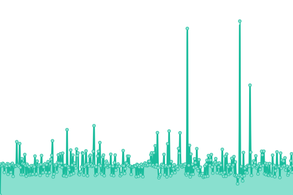

# [📈 Live Status](https://status.either.digital): <!--live status--> **🟩 All systems operational**

This repository contains the open-source uptime monitor and status page for [Either Digital](https://either.digital), powered by [Upptime](https://github.com/upptime/upptime).

With [Upptime](https://upptime.js.org), you can get your own unlimited and free uptime monitor and status page, powered entirely by a GitHub repository. We use [Issues](https://github.com/eitherdigital/upptime/issues) as incident reports, [Actions](https://github.com/eitherdigital/upptime/actions) as uptime monitors, and [Pages](https://status.either.digital) for the status page.

<!--start: status pages-->
<!-- This summary is generated by Upptime (https://github.com/upptime/upptime) -->
<!-- Do not edit this manually, your changes will be overwritten -->
<!-- prettier-ignore -->
| URL | Status | History | Response Time | Uptime |
| --- | ------ | ------- | ------------- | ------ |
|  [Landing](https://either.digital) | 🟩 Up | [landing.yml](https://github.com/eitherdigital/upptime/commits/HEAD/history/landing.yml) | 

 995ms
     
 | 

<a href="https://status.either.digital/history/landing">100.00%</a>
    

|  [API](https://lk.either.digital/api/v1/status) | 🟩 Up | [api.yml](https://github.com/eitherdigital/upptime/commits/HEAD/history/api.yml) | 

 618ms
     
 | 

<a href="https://status.either.digital/history/api">100.00%</a>
    

|  [LK](https://lk.either.digital) | 🟩 Up | [lk.yml](https://github.com/eitherdigital/upptime/commits/HEAD/history/lk.yml) | 

 236ms
     
 | 

<a href="https://status.either.digital/history/lk">100.00%</a>
    

|  [Smart Links](https://links.either.digital) | 🟩 Up | [smart-links.yml](https://github.com/eitherdigital/upptime/commits/HEAD/history/smart-links.yml) | 

 698ms
     
 | 

<a href="https://status.either.digital/history/smart-links">88.49%</a>
    

|  [Smart Links LK](https://llk.either.digital) | 🟩 Up | [smart-links-lk.yml](https://github.com/eitherdigital/upptime/commits/HEAD/history/smart-links-lk.yml) | 

 619ms
     
 | 

<a href="https://status.either.digital/history/smart-links-lk">88.49%</a>
    

<!--end: status pages-->

[**Visit our status website →**](https://status.either.digital)

## 📄 License

- Powered by: [Upptime](https://github.com/upptime/upptime)
- Code: [MIT](./LICENSE) © [EITHER.DIGITAL](https://either.digital)
- Data in the `./history` directory: [Open Database License](https://opendatacommons.org/licenses/odbl/1-0/)
